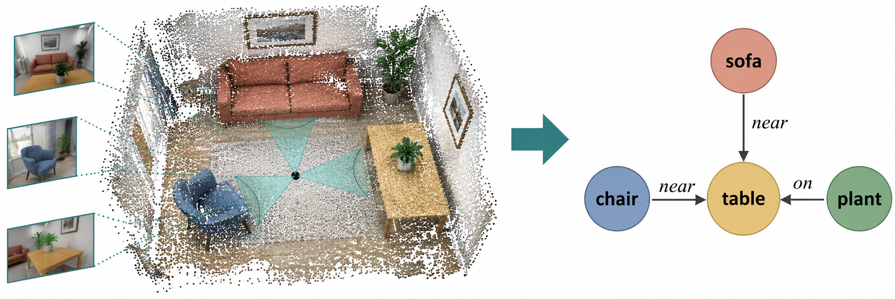

# Multi-View Spatial Graph

Spatial relation prediction from sparse RGB observations.

*Conceptual illustration from Figure 2 in the research proposal; not an experimental result.*

## Overview

<!-- Describe the research question, scope, and expected contributions. -->

## Setup

<!-- Add environment requirements and installation instructions. -->

## Data

<!-- Describe datasets, access instructions, and local path configuration. -->

## Usage

<!-- Add preprocessing, training, inference, and evaluation commands. -->

## Experiments and Results

<!-- Document the evaluation protocol, baselines, and verified results. -->

## Repository Structure

- `configs/`: experiment configuration.
- `src/`: reusable pipeline and model code.
- `scripts/`: task entry points.
- `tests/`: correctness checks.
- `notebooks/`: exploration and qualitative analysis.
- `assets/readme/`: version-controlled images used by this README.
- `data/` and `outputs/`: local data and generated artifacts, excluded from Git.

## References

<!-- Add relevant papers and citation information. -->
